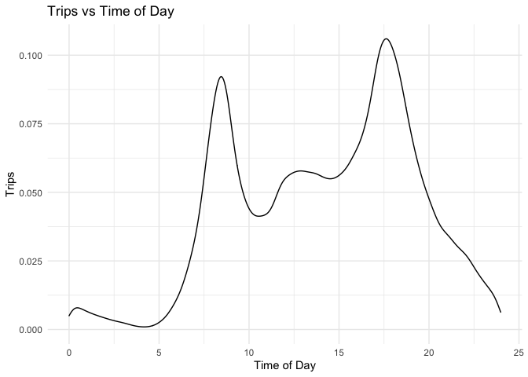

```r
library(tidyverse)     # for graphing and data cleaning
library(gardenR)       # for Lisa's garden data
library(lubridate)     # for date manipulation
library(ggthemes)      # for even more plotting themes
library(geofacet)      # for special faceting with US map layout
theme_set(theme_minimal())       # My favorite ggplot() theme :)
```


```r
# Lisa's garden data
data("garden_harvest")

# Seeds/plants (and other garden supply) costs
data("garden_spending")

# Planting dates and locations
data("garden_planting")

# Tidy Tuesday dog breed data
breed_traits <- readr::read_csv('https://raw.githubusercontent.com/rfordatascience/tidytuesday/master/data/2022/2022-02-01/breed_traits.csv')
trait_description <- readr::read_csv('https://raw.githubusercontent.com/rfordatascience/tidytuesday/master/data/2022/2022-02-01/trait_description.csv')
breed_rank_all <- readr::read_csv('https://raw.githubusercontent.com/rfordatascience/tidytuesday/master/data/2022/2022-02-01/breed_rank.csv')

# Tidy Tuesday data for challenge problem
kids <- readr::read_csv('https://raw.githubusercontent.com/rfordatascience/tidytuesday/master/data/2020/2020-09-15/kids.csv')
```

## Setting up on GitHub!

Before starting your assignment, you need to get yourself set up on GitHub and make sure GitHub is connected to R Studio. To do that, you should read the instruction (through the "Cloning a repo" section) and watch the video [here](https://github.com/llendway/github_for_collaboration/blob/master/github_for_collaboration.md). Then, do the following (if you get stuck on a step, don't worry, I will help! You can always get started on the homework and we can figure out the GitHub piece later):

* Create a repository on GitHub, giving it a nice name so you know it is for the 3rd weekly exercise assignment (follow the instructions in the document/video).  
* Copy the repo name so you can clone it to your computer. In R Studio, go to file --> New project --> Version control --> Git and follow the instructions from the document/video.  
* Download the code from this document and save it in the repository folder/project on your computer.  
* In R Studio, you should then see the .Rmd file in the upper right corner in the Git tab (along with the .Rproj file and probably .gitignore).  
* Check all the boxes of the files in the Git tab and choose commit.  
* In the commit window, write a commit message, something like "Initial upload" would be appropriate, and commit the files.  
* Either click the green up arrow in the commit window or close the commit window and click the green up arrow in the Git tab to push your changes to GitHub.  
* Refresh your GitHub page (online) and make sure the new documents have been pushed out.  
* Back in R Studio, knit the .Rmd file. When you do that, you should have two (as long as you didn't make any changes to the .Rmd file, in which case you might have three) files show up in the Git tab - an .html file and an .md file. The .md file is something we haven't seen before and is here because I included `keep_md: TRUE` in the YAML heading. The .md file is a markdown (NOT R Markdown) file that is an interim step to creating the html file. They are displayed fairly nicely in GitHub, so we want to keep it and look at it there. Click the boxes next to these two files, commit changes (remember to include a commit message), and push them (green up arrow).  
* As you work through your homework, save and commit often, push changes occasionally (maybe after you feel finished with an exercise?), and go check to see what the .md file looks like on GitHub.  
* If you have issues, let me know! This is new to many of you and may not be intuitive at first. But, I promise, you'll get the hang of it! 


## Instructions

* Put your name at the top of the document. 

* **For ALL graphs, you should include appropriate labels.** 

* Feel free to change the default theme, which I currently have set to `theme_minimal()`. 

* Use good coding practice. Read the short sections on good code with [pipes](https://style.tidyverse.org/pipes.html) and [ggplot2](https://style.tidyverse.org/ggplot2.html). **This is part of your grade!**

* When you are finished with ALL the exercises, uncomment the options at the top so your document looks nicer. Don't do it before then, or else you might miss some important warnings and messages.


## Warm-up exercises with garden data

These exercises will reiterate what you learned in the "Expanding the data wrangling toolkit" tutorial. If you haven't gone through the tutorial yet, you should do that first.

  1. Summarize the `garden_harvest` data to find the total harvest weight in pounds for each vegetable and day of week (HINT: use the `wday()` function from `lubridate`). Display the results so that the vegetables are rows but the days of the week are columns.


```r
garden_harvest %>% 
  mutate(day = wday(date,label=TRUE)) %>% 
  group_by(vegetable, day) %>% 
  summarise(total_wt = sum(weight)) %>% 
    pivot_wider(id_cols = vegetable,
                names_from = day,
                values_from = total_wt)
```

<div data-pagedtable="false">
  <script data-pagedtable-source type="application/json">
{"columns":[{"label":["vegetable"],"name":[1],"type":["chr"],"align":["left"]},{"label":["Sat"],"name":[2],"type":["dbl"],"align":["right"]},{"label":["Mon"],"name":[3],"type":["dbl"],"align":["right"]},{"label":["Tue"],"name":[4],"type":["dbl"],"align":["right"]},{"label":["Thu"],"name":[5],"type":["dbl"],"align":["right"]},{"label":["Fri"],"name":[6],"type":["dbl"],"align":["right"]},{"label":["Sun"],"name":[7],"type":["dbl"],"align":["right"]},{"label":["Wed"],"name":[8],"type":["dbl"],"align":["right"]}],"data":[{"1":"apple","2":"156","3":"NA","4":"NA","5":"NA","6":"NA","7":"NA","8":"NA"},{"1":"asparagus","2":"20","3":"NA","4":"NA","5":"NA","6":"NA","7":"NA","8":"NA"},{"1":"basil","2":"186","3":"30","4":"50","5":"12","6":"212","7":"NA","8":"NA"},{"1":"beans","2":"2136","3":"2952","4":"1990","5":"1539","6":"692","7":"868","8":"1852"},{"1":"beets","2":"172","3":"305","4":"72","5":"5394","6":"11","7":"146","8":"83"},{"1":"broccoli","2":"NA","3":"372","4":"NA","5":"NA","6":"75","7":"571","8":"321"},{"1":"carrots","2":"1057","3":"395","4":"160","5":"1213","6":"970","7":"1332","8":"2523"},{"1":"chives","2":"NA","3":"NA","4":"NA","5":"NA","6":"NA","7":"NA","8":"8"},{"1":"cilantro","2":"17","3":"NA","4":"2","5":"NA","6":"33","7":"NA","8":"NA"},{"1":"corn","2":"597","3":"344","4":"330","5":"NA","6":"1564","7":"661","8":"2405"},{"1":"cucumbers","2":"4373","3":"2166","4":"4557","5":"1500","6":"3370","7":"1408","8":"2407"},{"1":"edamame","2":"2127","3":"NA","4":"636","5":"NA","6":"NA","7":"NA","8":"NA"},{"1":"hot peppers","2":"NA","3":"571","4":"64","5":"NA","6":"NA","7":"NA","8":"31"},{"1":"jalapeño","2":"684","3":"2519","4":"249","5":"102","6":"587","7":"119","8":"218"},{"1":"kale","2":"676","3":"938","4":"128","5":"127","6":"173","7":"375","8":"280"},{"1":"kohlrabi","2":"NA","3":"NA","4":"NA","5":"191","6":"NA","7":"NA","8":"NA"},{"1":"lettuce","2":"597","3":"1115","4":"416","5":"1112","6":"817","7":"665","8":"538"},{"1":"onions","2":"868","3":"231","4":"321","5":"273","6":"33","7":"118","8":"NA"},{"1":"peas","2":"1294","3":"2102","4":"938","5":"1541","6":"425","7":"933","8":"490"},{"1":"peppers","2":"627","3":"1146","4":"655","5":"322","6":"152","7":"228","8":"1108"},{"1":"potatoes","2":"1271","3":"440","4":"NA","5":"5376","6":"1697","7":"NA","8":"2073"},{"1":"pumpkins","2":"42043","3":"13662","4":"14450","5":"NA","6":"NA","7":"NA","8":"NA"},{"1":"radish","2":"105","3":"89","4":"43","5":"67","6":"88","7":"37","8":"NA"},{"1":"raspberries","2":"242","3":"59","4":"152","5":"131","6":"259","7":"NA","8":"NA"},{"1":"rutabaga","2":"3129","3":"NA","4":"NA","5":"NA","6":"1623","7":"8738","8":"NA"},{"1":"spinach","2":"118","3":"67","4":"225","5":"106","6":"89","7":"221","8":"97"},{"1":"squash","2":"25502","3":"11038","4":"8377","5":"NA","6":"NA","7":"NA","8":"NA"},{"1":"strawberries","2":"77","3":"217","4":"NA","5":"40","6":"221","7":"37","8":"NA"},{"1":"Swiss chard","2":"333","3":"487","4":"32","5":"1012","6":"280","7":"566","8":"412"},{"1":"tomatoes","2":"15933","3":"5213","4":"22113","5":"15657","6":"38590","7":"34296","8":"26429"},{"1":"zucchini","2":"1549","3":"5532","4":"7470","5":"15708","6":"8492","7":"5550","8":"926"}],"options":{"columns":{"min":{},"max":[10]},"rows":{"min":[10],"max":[10]},"pages":{}}}
  </script>
</div>

  2. Summarize the `garden_harvest` data to find the total harvest in pound for each vegetable variety and then try adding the plot from the `garden_planting` table. This will not turn out perfectly. What is the problem? How might you fix it?


```r
a<- garden_harvest %>% 
  group_by(variety) %>% 
  summarise(total_weigh=sum(weight))

a %>% 
  left_join(garden_planting,
            by = "variety")
```

<div data-pagedtable="false">
  <script data-pagedtable-source type="application/json">
{"columns":[{"label":["variety"],"name":[1],"type":["chr"],"align":["left"]},{"label":["total_weigh"],"name":[2],"type":["dbl"],"align":["right"]},{"label":["plot"],"name":[3],"type":["chr"],"align":["left"]},{"label":["vegetable"],"name":[4],"type":["chr"],"align":["left"]},{"label":["number_seeds_planted"],"name":[5],"type":["dbl"],"align":["right"]},{"label":["date"],"name":[6],"type":["date"],"align":["right"]},{"label":["number_seeds_exact"],"name":[7],"type":["lgl"],"align":["right"]},{"label":["notes"],"name":[8],"type":["chr"],"align":["left"]}],"data":[{"1":"Amish Paste","2":"29789","3":"J","4":"tomatoes","5":"1","6":"2020-05-20","7":"TRUE","8":"NA"},{"1":"Amish Paste","2":"29789","3":"N","4":"tomatoes","5":"2","6":"2020-05-20","7":"TRUE","8":"NA"},{"1":"asparagus","2":"20","3":"NA","4":"NA","5":"NA","6":"<NA>","7":"NA","8":"NA"},{"1":"Better Boy","2":"15426","3":"J","4":"tomatoes","5":"1","6":"2020-05-20","7":"TRUE","8":"NA"},{"1":"Better Boy","2":"15426","3":"N","4":"tomatoes","5":"1","6":"2020-05-20","7":"TRUE","8":"NA"},{"1":"Big Beef","2":"11337","3":"N","4":"tomatoes","5":"1","6":"2020-05-20","7":"TRUE","8":"NA"},{"1":"Black Krim","2":"7170","3":"N","4":"tomatoes","5":"1","6":"2020-05-20","7":"TRUE","8":"NA"},{"1":"Blue (saved)","2":"18835","3":"A","4":"squash","5":"4","6":"2020-05-20","7":"TRUE","8":"NA"},{"1":"Blue (saved)","2":"18835","3":"B","4":"squash","5":"8","6":"2020-05-20","7":"TRUE","8":"NA"},{"1":"Bolero","2":"3761","3":"H","4":"carrots","5":"50","6":"2020-05-02","7":"FALSE","8":"NA"},{"1":"Bolero","2":"3761","3":"L","4":"carrots","5":"50","6":"2020-05-25","7":"FALSE","8":"NA"},{"1":"Bonny Best","2":"11305","3":"J","4":"tomatoes","5":"1","6":"2020-05-20","7":"TRUE","8":"NA"},{"1":"Brandywine","2":"7097","3":"J","4":"tomatoes","5":"1","6":"2020-05-20","7":"TRUE","8":"NA"},{"1":"Bush Bush Slender","2":"10038","3":"M","4":"beans","5":"30","6":"2020-05-16","7":"FALSE","8":"NA"},{"1":"Bush Bush Slender","2":"10038","3":"D","4":"beans","5":"10","6":"2020-05-21","7":"TRUE","8":"NA"},{"1":"Catalina","2":"923","3":"H","4":"spinach","5":"50","6":"2020-05-16","7":"FALSE","8":"NA"},{"1":"Catalina","2":"923","3":"E","4":"spinach","5":"100","6":"2020-06-20","7":"FALSE","8":"NA"},{"1":"Cherokee Purple","2":"7127","3":"J","4":"tomatoes","5":"1","6":"2020-05-20","7":"TRUE","8":"NA"},{"1":"Chinese Red Noodle","2":"356","3":"K","4":"beans","5":"5","6":"2020-05-25","7":"TRUE","8":"NA"},{"1":"Chinese Red Noodle","2":"356","3":"L","4":"beans","5":"5","6":"2020-05-25","7":"TRUE","8":"NA"},{"1":"cilantro","2":"52","3":"potD","4":"cilantro","5":"15","6":"2020-05-16","7":"FALSE","8":"NA"},{"1":"cilantro","2":"52","3":"E","4":"cilantro","5":"20","6":"2020-06-20","7":"FALSE","8":"NA"},{"1":"Cinderella's Carraige","2":"14911","3":"B","4":"pumpkins","5":"3","6":"2020-05-20","7":"TRUE","8":"NA"},{"1":"Classic Slenderette","2":"1635","3":"E","4":"beans","5":"29","6":"2020-06-20","7":"TRUE","8":"NA"},{"1":"Crispy Colors Duo","2":"191","3":"front","4":"kohlrabi","5":"10","6":"2020-05-20","7":"FALSE","8":"NA"},{"1":"delicata","2":"4762","3":"K","4":"squash","5":"8","6":"2020-05-25","7":"TRUE","8":"NA"},{"1":"Delicious Duo","2":"342","3":"P","4":"onions","5":"25","6":"2020-04-26","7":"FALSE","8":"NA"},{"1":"Dorinny Sweet","2":"5174","3":"A","4":"corn","5":"20","6":"2020-05-25","7":"FALSE","8":"NA"},{"1":"Dragon","2":"1862","3":"H","4":"carrots","5":"40","6":"2020-05-02","7":"FALSE","8":"NA"},{"1":"Dragon","2":"1862","3":"L","4":"carrots","5":"50","6":"2020-05-25","7":"FALSE","8":"NA"},{"1":"edamame","2":"2763","3":"O","4":"edamame","5":"25","6":"2020-05-16","7":"FALSE","8":"NA"},{"1":"Farmer's Market Blend","2":"1725","3":"C","4":"lettuce","5":"60","6":"2020-05-02","7":"FALSE","8":"NA"},{"1":"Farmer's Market Blend","2":"1725","3":"L","4":"lettuce","5":"60","6":"2020-05-16","7":"FALSE","8":"NA"},{"1":"Garden Party Mix","2":"429","3":"C","4":"radish","5":"20","6":"2020-05-02","7":"FALSE","8":"NA"},{"1":"Garden Party Mix","2":"429","3":"G","4":"radish","5":"30","6":"2020-05-02","7":"FALSE","8":"NA"},{"1":"Garden Party Mix","2":"429","3":"H","4":"radish","5":"15","6":"2020-05-02","7":"FALSE","8":"NA"},{"1":"giant","2":"4478","3":"L","4":"jalapeño","5":"4","6":"2020-05-21","7":"TRUE","8":"NA"},{"1":"Golden Bantam","2":"727","3":"B","4":"corn","5":"20","6":"2020-05-25","7":"FALSE","8":"NA"},{"1":"Gourmet Golden","2":"3185","3":"H","4":"beets","5":"40","6":"2020-05-02","7":"FALSE","8":"NA"},{"1":"grape","2":"14694","3":"O","4":"tomatoes","5":"1","6":"2020-05-20","7":"TRUE","8":"NA"},{"1":"green","2":"2582","3":"K","4":"peppers","5":"12","6":"2020-05-21","7":"TRUE","8":"NA"},{"1":"green","2":"2582","3":"O","4":"peppers","5":"5","6":"2020-05-21","7":"TRUE","8":"NA"},{"1":"greens","2":"169","3":"NA","4":"NA","5":"NA","6":"<NA>","7":"NA","8":"NA"},{"1":"Heirloom Lacinto","2":"2697","3":"P","4":"kale","5":"30","6":"2020-05-02","7":"FALSE","8":"NA"},{"1":"Heirloom Lacinto","2":"2697","3":"front","4":"kale","5":"30","6":"2020-06-20","7":"FALSE","8":"NA"},{"1":"Improved Helenor","2":"13490","3":"E","4":"rudabaga","5":"30","6":"2020-05-25","7":"FALSE","8":"NA"},{"1":"Isle of Naxos","2":"490","3":"potB","4":"basil","5":"40","6":"2020-05-16","7":"FALSE","8":"NA"},{"1":"Jet Star","2":"6815","3":"N","4":"tomatoes","5":"1","6":"2020-05-20","7":"TRUE","8":"NA"},{"1":"King Midas","2":"1858","3":"H","4":"carrots","5":"50","6":"2020-05-02","7":"FALSE","8":"NA"},{"1":"King Midas","2":"1858","3":"L","4":"carrots","5":"50","6":"2020-05-25","7":"FALSE","8":"NA"},{"1":"leaves","2":"101","3":"NA","4":"NA","5":"NA","6":"<NA>","7":"NA","8":"NA"},{"1":"Lettuce Mixture","2":"2154","3":"G","4":"lettuce","5":"200","6":"2020-06-20","7":"FALSE","8":"NA"},{"1":"Long Keeping Rainbow","2":"1502","3":"H","4":"onions","5":"40","6":"2020-04-26","7":"FALSE","8":"NA"},{"1":"Magnolia Blossom","2":"3383","3":"B","4":"peas","5":"24","6":"2020-04-19","7":"TRUE","8":"NA"},{"1":"Main Crop Bravado","2":"967","3":"D","4":"broccoli","5":"7","6":"2020-05-22","7":"TRUE","8":"NA"},{"1":"Main Crop Bravado","2":"967","3":"I","4":"broccoli","5":"7","6":"2020-05-22","7":"TRUE","8":"NA"},{"1":"Mortgage Lifter","2":"11941","3":"J","4":"tomatoes","5":"1","6":"2020-05-20","7":"TRUE","8":"died"},{"1":"Mortgage Lifter","2":"11941","3":"N","4":"tomatoes","5":"1","6":"2020-05-20","7":"TRUE","8":"NA"},{"1":"mustard greens","2":"23","3":"NA","4":"NA","5":"NA","6":"<NA>","7":"NA","8":"NA"},{"1":"Neon Glow","2":"3122","3":"M","4":"Swiss chard","5":"25","6":"2020-05-02","7":"FALSE","8":"NA"},{"1":"New England Sugar","2":"20348","3":"K","4":"pumpkins","5":"4","6":"2020-05-25","7":"TRUE","8":"NA"},{"1":"Old German","2":"12119","3":"J","4":"tomatoes","5":"1","6":"2020-05-20","7":"TRUE","8":"NA"},{"1":"perrenial","2":"1443","3":"NA","4":"NA","5":"NA","6":"<NA>","7":"NA","8":"NA"},{"1":"pickling","2":"19781","3":"L","4":"cucumbers","5":"20","6":"2020-05-25","7":"FALSE","8":"NA"},{"1":"purple","2":"1365","3":"D","4":"potatoes","5":"5","6":"2020-05-02","7":"FALSE","8":"NA"},{"1":"red","2":"2011","3":"I","4":"potatoes","5":"3","6":"2020-05-22","7":"FALSE","8":"NA"},{"1":"Red Kuri","2":"10311","3":"A","4":"squash","5":"4","6":"2020-05-20","7":"TRUE","8":"NA"},{"1":"Red Kuri","2":"10311","3":"B","4":"squash","5":"4","6":"2020-05-20","7":"TRUE","8":"NA"},{"1":"Red Kuri","2":"10311","3":"side","4":"squash","5":"1","6":"2020-05-20","7":"TRUE","8":"NA"},{"1":"reseed","2":"45","3":"NA","4":"NA","5":"NA","6":"<NA>","7":"NA","8":"NA"},{"1":"Romanesco","2":"45227","3":"D","4":"zucchini","5":"3","6":"2020-05-21","7":"TRUE","8":"NA"},{"1":"Russet","2":"4124","3":"D","4":"potatoes","5":"8","6":"2020-05-02","7":"FALSE","8":"NA"},{"1":"saved","2":"34896","3":"B","4":"pumpkins","5":"8","6":"2020-05-20","7":"TRUE","8":"NA"},{"1":"Super Sugar Snap","2":"4340","3":"A","4":"peas","5":"22","6":"2020-04-19","7":"TRUE","8":"NA"},{"1":"Sweet Merlin","2":"2897","3":"H","4":"beets","5":"40","6":"2020-05-02","7":"FALSE","8":"NA"},{"1":"Tatsoi","2":"1313","3":"P","4":"lettuce","5":"25","6":"2020-05-02","7":"FALSE","8":"NA"},{"1":"thai","2":"67","3":"potB","4":"hot peppers","5":"1","6":"2020-05-21","7":"TRUE","8":"NA"},{"1":"unknown","2":"156","3":"NA","4":"NA","5":"NA","6":"<NA>","7":"NA","8":"NA"},{"1":"variety","2":"2255","3":"potA","4":"peppers","5":"3","6":"2020-05-21","7":"TRUE","8":"NA"},{"1":"variety","2":"2255","3":"potA","4":"peppers","5":"3","6":"2020-05-21","7":"TRUE","8":"NA"},{"1":"variety","2":"2255","3":"potC","4":"hot peppers","5":"6","6":"2020-05-21","7":"TRUE","8":"NA"},{"1":"variety","2":"2255","3":"potD","4":"peppers","5":"1","6":"2020-05-21","7":"TRUE","8":"NA"},{"1":"volunteers","2":"23411","3":"N","4":"tomatoes","5":"1","6":"2020-06-03","7":"TRUE","8":"NA"},{"1":"volunteers","2":"23411","3":"J","4":"tomatoes","5":"1","6":"2020-06-03","7":"TRUE","8":"NA"},{"1":"volunteers","2":"23411","3":"front","4":"tomatoes","5":"5","6":"2020-06-03","7":"TRUE","8":"NA"},{"1":"volunteers","2":"23411","3":"O","4":"tomatoes","5":"2","6":"2020-06-03","7":"TRUE","8":"NA"},{"1":"Waltham Butternut","2":"11009","3":"A","4":"squash","5":"4","6":"2020-05-20","7":"TRUE","8":"NA"},{"1":"Waltham Butternut","2":"11009","3":"K","4":"squash","5":"6","6":"2020-05-25","7":"TRUE","8":"NA"},{"1":"yellow","2":"3357","3":"I","4":"potatoes","5":"10","6":"2020-05-02","7":"FALSE","8":"NA"},{"1":"yellow","2":"3357","3":"I","4":"potatoes","5":"8","6":"2020-05-22","7":"TRUE","8":"NA"},{"1":"Yod Fah","2":"372","3":"P","4":"broccoli","5":"25","6":"2020-05-16","7":"FALSE","8":"NA"}],"options":{"columns":{"min":{},"max":[10]},"rows":{"min":[10],"max":[10]},"pages":{}}}
  </script>
</div>

The problem is too many rows. It is happening because some varieties were planted in different plots same day. If plot is not important for our purpose we can take only the first occurence of each date rather than repeating for each plot


  3. I would like to understand how much money I "saved" by gardening, for each vegetable type. Describe how I could use the `garden_harvest` and `garden_spending` datasets, along with data from somewhere like [this](https://products.wholefoodsmarket.com/search?sort=relevance&store=10542) to answer this question. You can answer this in words, referencing various join functions. You don't need R code but could provide some if it's helpful.
  
You could summarize harvest to show total pounds for each variety, then left join spending to that data set by variety. You would then left join whole food $/lb/variety data vy variety. At that point you could sum the "price + tax" column to find total spent. Then you'd need to summarise each value in the total harvest weight column as mulptiled by the whole foods variety price. Finally, you would sum that new column and subtract that value from your total spent.
 

  

  4. Subset the data to tomatoes. Reorder the tomato varieties from smallest to largest first harvest date. Create a barplot of total harvest in pounds for each variety, in the new order.CHALLENGE: add the date near the end of the bar. (This is probably not a super useful graph because it's difficult to read. This is more an exercise in using some of the functions you just learned.)


```r
garden_harvest %>% 
  filter(vegetable=="tomatoes") %>%
  group_by(variety) %>%
  mutate(min_date = min(date)) %>%
  mutate(t_weight=sum(weight)) %>% 
  ggplot(aes(y=t_weight,x=reorder(variety,min_date)))+
  geom_col()+
  theme(axis.text.x=element_text(angle=90, hjust=1))+
  labs(title="Weight by tomato variety", y="Weight in grams",x="Variety")
```

<!-- -->

  5. In the `garden_harvest` data, create two new variables: one that makes the varieties lowercase and another that finds the length of the variety name. Arrange the data by vegetable and length of variety name (smallest to largest), with one row for each vegetable variety. HINT: use `str_to_lower()`, `str_length()`, and `distinct()`.
  

```r
garden_harvest %>% 
  mutate(lower=str_to_lower(variety)) %>% 
  mutate(lower_count=str_length(lower)) %>%
  select(vegetable,lower,lower_count) %>% 
  arrange(lower_count)
```

<div data-pagedtable="false">
  <script data-pagedtable-source type="application/json">
{"columns":[{"label":["vegetable"],"name":[1],"type":["chr"],"align":["left"]},{"label":["lower"],"name":[2],"type":["chr"],"align":["left"]},{"label":["lower_count"],"name":[3],"type":["int"],"align":["right"]}],"data":[{"1":"potatoes","2":"red","3":"3"},{"1":"potatoes","2":"red","3":"3"},{"1":"hot peppers","2":"thai","3":"4"},{"1":"hot peppers","2":"thai","3":"4"},{"1":"hot peppers","2":"thai","3":"4"},{"1":"tomatoes","2":"grape","3":"5"},{"1":"jalapeño","2":"giant","3":"5"},{"1":"jalapeño","2":"giant","3":"5"},{"1":"tomatoes","2":"grape","3":"5"},{"1":"tomatoes","2":"grape","3":"5"},{"1":"tomatoes","2":"grape","3":"5"},{"1":"tomatoes","2":"grape","3":"5"},{"1":"tomatoes","2":"grape","3":"5"},{"1":"tomatoes","2":"grape","3":"5"},{"1":"tomatoes","2":"grape","3":"5"},{"1":"tomatoes","2":"grape","3":"5"},{"1":"jalapeño","2":"giant","3":"5"},{"1":"tomatoes","2":"grape","3":"5"},{"1":"tomatoes","2":"grape","3":"5"},{"1":"jalapeño","2":"giant","3":"5"},{"1":"peppers","2":"green","3":"5"},{"1":"jalapeño","2":"giant","3":"5"},{"1":"tomatoes","2":"grape","3":"5"},{"1":"tomatoes","2":"grape","3":"5"},{"1":"tomatoes","2":"grape","3":"5"},{"1":"tomatoes","2":"grape","3":"5"},{"1":"tomatoes","2":"grape","3":"5"},{"1":"tomatoes","2":"grape","3":"5"},{"1":"tomatoes","2":"grape","3":"5"},{"1":"tomatoes","2":"grape","3":"5"},{"1":"tomatoes","2":"grape","3":"5"},{"1":"tomatoes","2":"grape","3":"5"},{"1":"tomatoes","2":"grape","3":"5"},{"1":"tomatoes","2":"grape","3":"5"},{"1":"peppers","2":"green","3":"5"},{"1":"jalapeño","2":"giant","3":"5"},{"1":"tomatoes","2":"grape","3":"5"},{"1":"tomatoes","2":"grape","3":"5"},{"1":"peppers","2":"green","3":"5"},{"1":"tomatoes","2":"grape","3":"5"},{"1":"tomatoes","2":"grape","3":"5"},{"1":"tomatoes","2":"grape","3":"5"},{"1":"tomatoes","2":"grape","3":"5"},{"1":"jalapeño","2":"giant","3":"5"},{"1":"tomatoes","2":"grape","3":"5"},{"1":"pumpkins","2":"saved","3":"5"},{"1":"pumpkins","2":"saved","3":"5"},{"1":"peppers","2":"green","3":"5"},{"1":"jalapeño","2":"giant","3":"5"},{"1":"tomatoes","2":"grape","3":"5"},{"1":"jalapeño","2":"giant","3":"5"},{"1":"tomatoes","2":"grape","3":"5"},{"1":"jalapeño","2":"giant","3":"5"},{"1":"tomatoes","2":"grape","3":"5"},{"1":"tomatoes","2":"grape","3":"5"},{"1":"tomatoes","2":"grape","3":"5"},{"1":"tomatoes","2":"grape","3":"5"},{"1":"pumpkins","2":"saved","3":"5"},{"1":"pumpkins","2":"saved","3":"5"},{"1":"pumpkins","2":"saved","3":"5"},{"1":"pumpkins","2":"saved","3":"5"},{"1":"pumpkins","2":"saved","3":"5"},{"1":"pumpkins","2":"saved","3":"5"},{"1":"tomatoes","2":"grape","3":"5"},{"1":"peppers","2":"green","3":"5"},{"1":"tomatoes","2":"grape","3":"5"},{"1":"peppers","2":"green","3":"5"},{"1":"tomatoes","2":"grape","3":"5"},{"1":"jalapeño","2":"giant","3":"5"},{"1":"jalapeño","2":"giant","3":"5"},{"1":"peppers","2":"green","3":"5"},{"1":"peppers","2":"green","3":"5"},{"1":"jalapeño","2":"giant","3":"5"},{"1":"pumpkins","2":"saved","3":"5"},{"1":"pumpkins","2":"saved","3":"5"},{"1":"peppers","2":"green","3":"5"},{"1":"jalapeño","2":"giant","3":"5"},{"1":"lettuce","2":"reseed","3":"6"},{"1":"lettuce","2":"reseed","3":"6"},{"1":"lettuce","2":"reseed","3":"6"},{"1":"beets","2":"leaves","3":"6"},{"1":"beets","2":"leaves","3":"6"},{"1":"beets","2":"leaves","3":"6"},{"1":"lettuce","2":"tatsoi","3":"6"},{"1":"beets","2":"leaves","3":"6"},{"1":"lettuce","2":"tatsoi","3":"6"},{"1":"lettuce","2":"tatsoi","3":"6"},{"1":"lettuce","2":"tatsoi","3":"6"},{"1":"lettuce","2":"tatsoi","3":"6"},{"1":"lettuce","2":"tatsoi","3":"6"},{"1":"lettuce","2":"tatsoi","3":"6"},{"1":"lettuce","2":"tatsoi","3":"6"},{"1":"carrots","2":"dragon","3":"6"},{"1":"carrots","2":"bolero","3":"6"},{"1":"carrots","2":"bolero","3":"6"},{"1":"carrots","2":"dragon","3":"6"},{"1":"potatoes","2":"purple","3":"6"},{"1":"potatoes","2":"yellow","3":"6"},{"1":"carrots","2":"bolero","3":"6"},{"1":"potatoes","2":"yellow","3":"6"},{"1":"potatoes","2":"purple","3":"6"},{"1":"carrots","2":"bolero","3":"6"},{"1":"potatoes","2":"purple","3":"6"},{"1":"potatoes","2":"yellow","3":"6"},{"1":"lettuce","2":"tatsoi","3":"6"},{"1":"carrots","2":"dragon","3":"6"},{"1":"potatoes","2":"purple","3":"6"},{"1":"potatoes","2":"yellow","3":"6"},{"1":"carrots","2":"bolero","3":"6"},{"1":"carrots","2":"greens","3":"6"},{"1":"potatoes","2":"yellow","3":"6"},{"1":"potatoes","2":"russet","3":"6"},{"1":"carrots","2":"bolero","3":"6"},{"1":"carrots","2":"dragon","3":"6"},{"1":"carrots","2":"bolero","3":"6"},{"1":"potatoes","2":"russet","3":"6"},{"1":"potatoes","2":"yellow","3":"6"},{"1":"potatoes","2":"russet","3":"6"},{"1":"potatoes","2":"yellow","3":"6"},{"1":"carrots","2":"bolero","3":"6"},{"1":"potatoes","2":"russet","3":"6"},{"1":"potatoes","2":"yellow","3":"6"},{"1":"potatoes","2":"purple","3":"6"},{"1":"hot peppers","2":"variety","3":"7"},{"1":"peppers","2":"variety","3":"7"},{"1":"broccoli","2":"yod fah","3":"7"},{"1":"peppers","2":"variety","3":"7"},{"1":"peppers","2":"variety","3":"7"},{"1":"hot peppers","2":"variety","3":"7"},{"1":"edamame","2":"edamame","3":"7"},{"1":"peppers","2":"variety","3":"7"},{"1":"edamame","2":"edamame","3":"7"},{"1":"peppers","2":"variety","3":"7"},{"1":"edamame","2":"edamame","3":"7"},{"1":"peppers","2":"variety","3":"7"},{"1":"peppers","2":"variety","3":"7"},{"1":"edamame","2":"edamame","3":"7"},{"1":"peppers","2":"variety","3":"7"},{"1":"apple","2":"unknown","3":"7"},{"1":"peppers","2":"variety","3":"7"},{"1":"peppers","2":"variety","3":"7"},{"1":"spinach","2":"catalina","3":"8"},{"1":"spinach","2":"catalina","3":"8"},{"1":"spinach","2":"catalina","3":"8"},{"1":"spinach","2":"catalina","3":"8"},{"1":"spinach","2":"catalina","3":"8"},{"1":"spinach","2":"catalina","3":"8"},{"1":"spinach","2":"catalina","3":"8"},{"1":"spinach","2":"catalina","3":"8"},{"1":"spinach","2":"catalina","3":"8"},{"1":"spinach","2":"catalina","3":"8"},{"1":"cilantro","2":"cilantro","3":"8"},{"1":"spinach","2":"catalina","3":"8"},{"1":"spinach","2":"catalina","3":"8"},{"1":"spinach","2":"catalina","3":"8"},{"1":"spinach","2":"catalina","3":"8"},{"1":"spinach","2":"catalina","3":"8"},{"1":"cucumbers","2":"pickling","3":"8"},{"1":"cucumbers","2":"pickling","3":"8"},{"1":"spinach","2":"catalina","3":"8"},{"1":"cucumbers","2":"pickling","3":"8"},{"1":"cucumbers","2":"pickling","3":"8"},{"1":"cucumbers","2":"pickling","3":"8"},{"1":"cucumbers","2":"pickling","3":"8"},{"1":"spinach","2":"catalina","3":"8"},{"1":"cilantro","2":"cilantro","3":"8"},{"1":"cucumbers","2":"pickling","3":"8"},{"1":"cucumbers","2":"pickling","3":"8"},{"1":"cucumbers","2":"pickling","3":"8"},{"1":"cucumbers","2":"pickling","3":"8"},{"1":"tomatoes","2":"big beef","3":"8"},{"1":"spinach","2":"catalina","3":"8"},{"1":"cucumbers","2":"pickling","3":"8"},{"1":"cucumbers","2":"pickling","3":"8"},{"1":"cucumbers","2":"pickling","3":"8"},{"1":"cucumbers","2":"pickling","3":"8"},{"1":"tomatoes","2":"big beef","3":"8"},{"1":"tomatoes","2":"jet star","3":"8"},{"1":"cucumbers","2":"pickling","3":"8"},{"1":"cucumbers","2":"pickling","3":"8"},{"1":"cucumbers","2":"pickling","3":"8"},{"1":"spinach","2":"catalina","3":"8"},{"1":"cucumbers","2":"pickling","3":"8"},{"1":"cucumbers","2":"pickling","3":"8"},{"1":"cilantro","2":"cilantro","3":"8"},{"1":"cucumbers","2":"pickling","3":"8"},{"1":"spinach","2":"catalina","3":"8"},{"1":"tomatoes","2":"big beef","3":"8"},{"1":"tomatoes","2":"big beef","3":"8"},{"1":"cucumbers","2":"pickling","3":"8"},{"1":"tomatoes","2":"jet star","3":"8"},{"1":"cucumbers","2":"pickling","3":"8"},{"1":"tomatoes","2":"big beef","3":"8"},{"1":"tomatoes","2":"jet star","3":"8"},{"1":"cucumbers","2":"pickling","3":"8"},{"1":"tomatoes","2":"jet star","3":"8"},{"1":"tomatoes","2":"jet star","3":"8"},{"1":"cucumbers","2":"pickling","3":"8"},{"1":"tomatoes","2":"big beef","3":"8"},{"1":"cucumbers","2":"pickling","3":"8"},{"1":"tomatoes","2":"jet star","3":"8"},{"1":"tomatoes","2":"big beef","3":"8"},{"1":"cucumbers","2":"pickling","3":"8"},{"1":"tomatoes","2":"big beef","3":"8"},{"1":"spinach","2":"catalina","3":"8"},{"1":"cucumbers","2":"pickling","3":"8"},{"1":"spinach","2":"catalina","3":"8"},{"1":"cucumbers","2":"pickling","3":"8"},{"1":"tomatoes","2":"big beef","3":"8"},{"1":"cucumbers","2":"pickling","3":"8"},{"1":"tomatoes","2":"jet star","3":"8"},{"1":"tomatoes","2":"big beef","3":"8"},{"1":"tomatoes","2":"big beef","3":"8"},{"1":"cucumbers","2":"pickling","3":"8"},{"1":"cucumbers","2":"pickling","3":"8"},{"1":"tomatoes","2":"jet star","3":"8"},{"1":"cucumbers","2":"pickling","3":"8"},{"1":"tomatoes","2":"big beef","3":"8"},{"1":"tomatoes","2":"big beef","3":"8"},{"1":"tomatoes","2":"big beef","3":"8"},{"1":"tomatoes","2":"jet star","3":"8"},{"1":"tomatoes","2":"jet star","3":"8"},{"1":"tomatoes","2":"big beef","3":"8"},{"1":"tomatoes","2":"jet star","3":"8"},{"1":"tomatoes","2":"big beef","3":"8"},{"1":"tomatoes","2":"jet star","3":"8"},{"1":"tomatoes","2":"big beef","3":"8"},{"1":"squash","2":"delicata","3":"8"},{"1":"squash","2":"delicata","3":"8"},{"1":"squash","2":"delicata","3":"8"},{"1":"squash","2":"delicata","3":"8"},{"1":"squash","2":"delicata","3":"8"},{"1":"squash","2":"delicata","3":"8"},{"1":"squash","2":"delicata","3":"8"},{"1":"squash","2":"delicata","3":"8"},{"1":"squash","2":"delicata","3":"8"},{"1":"squash","2":"delicata","3":"8"},{"1":"squash","2":"delicata","3":"8"},{"1":"squash","2":"red kuri","3":"8"},{"1":"squash","2":"red kuri","3":"8"},{"1":"squash","2":"red kuri","3":"8"},{"1":"squash","2":"red kuri","3":"8"},{"1":"tomatoes","2":"big beef","3":"8"},{"1":"tomatoes","2":"jet star","3":"8"},{"1":"tomatoes","2":"big beef","3":"8"},{"1":"tomatoes","2":"big beef","3":"8"},{"1":"squash","2":"red kuri","3":"8"},{"1":"squash","2":"delicata","3":"8"},{"1":"squash","2":"red kuri","3":"8"},{"1":"squash","2":"red kuri","3":"8"},{"1":"tomatoes","2":"big beef","3":"8"},{"1":"chives","2":"perrenial","3":"9"},{"1":"strawberries","2":"perrenial","3":"9"},{"1":"asparagus","2":"asparagus","3":"9"},{"1":"Swiss chard","2":"neon glow","3":"9"},{"1":"Swiss chard","2":"neon glow","3":"9"},{"1":"strawberries","2":"perrenial","3":"9"},{"1":"strawberries","2":"perrenial","3":"9"},{"1":"raspberries","2":"perrenial","3":"9"},{"1":"Swiss chard","2":"neon glow","3":"9"},{"1":"zucchini","2":"romanesco","3":"9"},{"1":"Swiss chard","2":"neon glow","3":"9"},{"1":"raspberries","2":"perrenial","3":"9"},{"1":"raspberries","2":"perrenial","3":"9"},{"1":"raspberries","2":"perrenial","3":"9"},{"1":"strawberries","2":"perrenial","3":"9"},{"1":"raspberries","2":"perrenial","3":"9"},{"1":"zucchini","2":"romanesco","3":"9"},{"1":"zucchini","2":"romanesco","3":"9"},{"1":"strawberries","2":"perrenial","3":"9"},{"1":"raspberries","2":"perrenial","3":"9"},{"1":"zucchini","2":"romanesco","3":"9"},{"1":"Swiss chard","2":"neon glow","3":"9"},{"1":"strawberries","2":"perrenial","3":"9"},{"1":"raspberries","2":"perrenial","3":"9"},{"1":"zucchini","2":"romanesco","3":"9"},{"1":"zucchini","2":"romanesco","3":"9"},{"1":"strawberries","2":"perrenial","3":"9"},{"1":"zucchini","2":"romanesco","3":"9"},{"1":"Swiss chard","2":"neon glow","3":"9"},{"1":"zucchini","2":"romanesco","3":"9"},{"1":"zucchini","2":"romanesco","3":"9"},{"1":"Swiss chard","2":"neon glow","3":"9"},{"1":"zucchini","2":"romanesco","3":"9"},{"1":"raspberries","2":"perrenial","3":"9"},{"1":"strawberries","2":"perrenial","3":"9"},{"1":"zucchini","2":"romanesco","3":"9"},{"1":"strawberries","2":"perrenial","3":"9"},{"1":"raspberries","2":"perrenial","3":"9"},{"1":"zucchini","2":"romanesco","3":"9"},{"1":"zucchini","2":"romanesco","3":"9"},{"1":"strawberries","2":"perrenial","3":"9"},{"1":"zucchini","2":"romanesco","3":"9"},{"1":"zucchini","2":"romanesco","3":"9"},{"1":"zucchini","2":"romanesco","3":"9"},{"1":"zucchini","2":"romanesco","3":"9"},{"1":"zucchini","2":"romanesco","3":"9"},{"1":"zucchini","2":"romanesco","3":"9"},{"1":"zucchini","2":"romanesco","3":"9"},{"1":"Swiss chard","2":"neon glow","3":"9"},{"1":"Swiss chard","2":"neon glow","3":"9"},{"1":"zucchini","2":"romanesco","3":"9"},{"1":"zucchini","2":"romanesco","3":"9"},{"1":"Swiss chard","2":"neon glow","3":"9"},{"1":"zucchini","2":"romanesco","3":"9"},{"1":"zucchini","2":"romanesco","3":"9"},{"1":"zucchini","2":"romanesco","3":"9"},{"1":"zucchini","2":"romanesco","3":"9"},{"1":"zucchini","2":"romanesco","3":"9"},{"1":"zucchini","2":"romanesco","3":"9"},{"1":"zucchini","2":"romanesco","3":"9"},{"1":"zucchini","2":"romanesco","3":"9"},{"1":"raspberries","2":"perrenial","3":"9"},{"1":"zucchini","2":"romanesco","3":"9"},{"1":"zucchini","2":"romanesco","3":"9"},{"1":"Swiss chard","2":"neon glow","3":"9"},{"1":"zucchini","2":"romanesco","3":"9"},{"1":"zucchini","2":"romanesco","3":"9"},{"1":"Swiss chard","2":"neon glow","3":"9"},{"1":"raspberries","2":"perrenial","3":"9"},{"1":"Swiss chard","2":"neon glow","3":"9"},{"1":"Swiss chard","2":"neon glow","3":"9"},{"1":"Swiss chard","2":"neon glow","3":"9"},{"1":"Swiss chard","2":"neon glow","3":"9"},{"1":"zucchini","2":"romanesco","3":"9"},{"1":"zucchini","2":"romanesco","3":"9"},{"1":"zucchini","2":"romanesco","3":"9"},{"1":"Swiss chard","2":"neon glow","3":"9"},{"1":"tomatoes","2":"bonny best","3":"10"},{"1":"carrots","2":"king midas","3":"10"},{"1":"tomatoes","2":"bonny best","3":"10"},{"1":"tomatoes","2":"better boy","3":"10"},{"1":"carrots","2":"king midas","3":"10"},{"1":"tomatoes","2":"bonny best","3":"10"},{"1":"carrots","2":"king midas","3":"10"},{"1":"carrots","2":"king midas","3":"10"},{"1":"tomatoes","2":"old german","3":"10"},{"1":"tomatoes","2":"better boy","3":"10"},{"1":"tomatoes","2":"bonny best","3":"10"},{"1":"tomatoes","2":"better boy","3":"10"},{"1":"carrots","2":"king midas","3":"10"},{"1":"tomatoes","2":"old german","3":"10"},{"1":"tomatoes","2":"better boy","3":"10"},{"1":"tomatoes","2":"bonny best","3":"10"},{"1":"tomatoes","2":"brandywine","3":"10"},{"1":"tomatoes","2":"black krim","3":"10"},{"1":"tomatoes","2":"black krim","3":"10"},{"1":"tomatoes","2":"old german","3":"10"},{"1":"tomatoes","2":"bonny best","3":"10"},{"1":"tomatoes","2":"better boy","3":"10"},{"1":"tomatoes","2":"better boy","3":"10"},{"1":"tomatoes","2":"bonny best","3":"10"},{"1":"tomatoes","2":"brandywine","3":"10"},{"1":"tomatoes","2":"volunteers","3":"10"},{"1":"tomatoes","2":"bonny best","3":"10"},{"1":"tomatoes","2":"brandywine","3":"10"},{"1":"tomatoes","2":"volunteers","3":"10"},{"1":"tomatoes","2":"black krim","3":"10"},{"1":"tomatoes","2":"bonny best","3":"10"},{"1":"tomatoes","2":"brandywine","3":"10"},{"1":"tomatoes","2":"old german","3":"10"},{"1":"tomatoes","2":"better boy","3":"10"},{"1":"tomatoes","2":"bonny best","3":"10"},{"1":"tomatoes","2":"bonny best","3":"10"},{"1":"tomatoes","2":"better boy","3":"10"},{"1":"tomatoes","2":"volunteers","3":"10"},{"1":"tomatoes","2":"bonny best","3":"10"},{"1":"tomatoes","2":"volunteers","3":"10"},{"1":"tomatoes","2":"brandywine","3":"10"},{"1":"tomatoes","2":"better boy","3":"10"},{"1":"tomatoes","2":"black krim","3":"10"},{"1":"tomatoes","2":"bonny best","3":"10"},{"1":"tomatoes","2":"better boy","3":"10"},{"1":"tomatoes","2":"bonny best","3":"10"},{"1":"tomatoes","2":"old german","3":"10"},{"1":"tomatoes","2":"volunteers","3":"10"},{"1":"tomatoes","2":"volunteers","3":"10"},{"1":"tomatoes","2":"bonny best","3":"10"},{"1":"tomatoes","2":"old german","3":"10"},{"1":"tomatoes","2":"black krim","3":"10"},{"1":"tomatoes","2":"better boy","3":"10"},{"1":"tomatoes","2":"bonny best","3":"10"},{"1":"tomatoes","2":"brandywine","3":"10"},{"1":"tomatoes","2":"better boy","3":"10"},{"1":"tomatoes","2":"volunteers","3":"10"},{"1":"tomatoes","2":"volunteers","3":"10"},{"1":"tomatoes","2":"black krim","3":"10"},{"1":"tomatoes","2":"old german","3":"10"},{"1":"tomatoes","2":"bonny best","3":"10"},{"1":"tomatoes","2":"black krim","3":"10"},{"1":"tomatoes","2":"better boy","3":"10"},{"1":"tomatoes","2":"brandywine","3":"10"},{"1":"tomatoes","2":"volunteers","3":"10"},{"1":"tomatoes","2":"volunteers","3":"10"},{"1":"tomatoes","2":"brandywine","3":"10"},{"1":"tomatoes","2":"bonny best","3":"10"},{"1":"tomatoes","2":"better boy","3":"10"},{"1":"tomatoes","2":"black krim","3":"10"},{"1":"tomatoes","2":"old german","3":"10"},{"1":"tomatoes","2":"bonny best","3":"10"},{"1":"tomatoes","2":"volunteers","3":"10"},{"1":"tomatoes","2":"old german","3":"10"},{"1":"tomatoes","2":"black krim","3":"10"},{"1":"tomatoes","2":"brandywine","3":"10"},{"1":"tomatoes","2":"bonny best","3":"10"},{"1":"tomatoes","2":"brandywine","3":"10"},{"1":"tomatoes","2":"old german","3":"10"},{"1":"tomatoes","2":"bonny best","3":"10"},{"1":"tomatoes","2":"volunteers","3":"10"},{"1":"tomatoes","2":"old german","3":"10"},{"1":"tomatoes","2":"brandywine","3":"10"},{"1":"tomatoes","2":"black krim","3":"10"},{"1":"tomatoes","2":"better boy","3":"10"},{"1":"tomatoes","2":"volunteers","3":"10"},{"1":"tomatoes","2":"volunteers","3":"10"},{"1":"tomatoes","2":"volunteers","3":"10"},{"1":"tomatoes","2":"old german","3":"10"},{"1":"tomatoes","2":"brandywine","3":"10"},{"1":"tomatoes","2":"bonny best","3":"10"},{"1":"tomatoes","2":"volunteers","3":"10"},{"1":"tomatoes","2":"better boy","3":"10"},{"1":"tomatoes","2":"volunteers","3":"10"},{"1":"tomatoes","2":"old german","3":"10"},{"1":"tomatoes","2":"brandywine","3":"10"},{"1":"tomatoes","2":"volunteers","3":"10"},{"1":"tomatoes","2":"better boy","3":"10"},{"1":"tomatoes","2":"volunteers","3":"10"},{"1":"tomatoes","2":"brandywine","3":"10"},{"1":"tomatoes","2":"volunteers","3":"10"},{"1":"tomatoes","2":"bonny best","3":"10"},{"1":"tomatoes","2":"old german","3":"10"},{"1":"tomatoes","2":"better boy","3":"10"},{"1":"tomatoes","2":"volunteers","3":"10"},{"1":"tomatoes","2":"volunteers","3":"10"},{"1":"carrots","2":"king midas","3":"10"},{"1":"tomatoes","2":"volunteers","3":"10"},{"1":"tomatoes","2":"brandywine","3":"10"},{"1":"tomatoes","2":"better boy","3":"10"},{"1":"tomatoes","2":"bonny best","3":"10"},{"1":"tomatoes","2":"old german","3":"10"},{"1":"tomatoes","2":"volunteers","3":"10"},{"1":"tomatoes","2":"bonny best","3":"10"},{"1":"tomatoes","2":"volunteers","3":"10"},{"1":"tomatoes","2":"bonny best","3":"10"},{"1":"tomatoes","2":"black krim","3":"10"},{"1":"tomatoes","2":"old german","3":"10"},{"1":"tomatoes","2":"better boy","3":"10"},{"1":"tomatoes","2":"volunteers","3":"10"},{"1":"tomatoes","2":"better boy","3":"10"},{"1":"tomatoes","2":"volunteers","3":"10"},{"1":"tomatoes","2":"old german","3":"10"},{"1":"tomatoes","2":"volunteers","3":"10"},{"1":"tomatoes","2":"volunteers","3":"10"},{"1":"tomatoes","2":"black krim","3":"10"},{"1":"tomatoes","2":"old german","3":"10"},{"1":"tomatoes","2":"better boy","3":"10"},{"1":"tomatoes","2":"bonny best","3":"10"},{"1":"tomatoes","2":"volunteers","3":"10"},{"1":"tomatoes","2":"brandywine","3":"10"},{"1":"tomatoes","2":"old german","3":"10"},{"1":"tomatoes","2":"better boy","3":"10"},{"1":"tomatoes","2":"volunteers","3":"10"},{"1":"carrots","2":"king midas","3":"10"},{"1":"tomatoes","2":"amish paste","3":"11"},{"1":"tomatoes","2":"amish paste","3":"11"},{"1":"tomatoes","2":"amish paste","3":"11"},{"1":"tomatoes","2":"amish paste","3":"11"},{"1":"tomatoes","2":"amish paste","3":"11"},{"1":"tomatoes","2":"amish paste","3":"11"},{"1":"tomatoes","2":"amish paste","3":"11"},{"1":"tomatoes","2":"amish paste","3":"11"},{"1":"tomatoes","2":"amish paste","3":"11"},{"1":"tomatoes","2":"amish paste","3":"11"},{"1":"tomatoes","2":"amish paste","3":"11"},{"1":"tomatoes","2":"amish paste","3":"11"},{"1":"tomatoes","2":"amish paste","3":"11"},{"1":"tomatoes","2":"amish paste","3":"11"},{"1":"tomatoes","2":"amish paste","3":"11"},{"1":"tomatoes","2":"amish paste","3":"11"},{"1":"tomatoes","2":"amish paste","3":"11"},{"1":"tomatoes","2":"amish paste","3":"11"},{"1":"tomatoes","2":"amish paste","3":"11"},{"1":"tomatoes","2":"amish paste","3":"11"},{"1":"tomatoes","2":"amish paste","3":"11"},{"1":"tomatoes","2":"amish paste","3":"11"},{"1":"tomatoes","2":"amish paste","3":"11"},{"1":"tomatoes","2":"amish paste","3":"11"},{"1":"tomatoes","2":"amish paste","3":"11"},{"1":"tomatoes","2":"amish paste","3":"11"},{"1":"tomatoes","2":"amish paste","3":"11"},{"1":"tomatoes","2":"amish paste","3":"11"},{"1":"tomatoes","2":"amish paste","3":"11"},{"1":"tomatoes","2":"amish paste","3":"11"},{"1":"beets","2":"sweet merlin","3":"12"},{"1":"beets","2":"sweet merlin","3":"12"},{"1":"beets","2":"sweet merlin","3":"12"},{"1":"beets","2":"sweet merlin","3":"12"},{"1":"beets","2":"sweet merlin","3":"12"},{"1":"beets","2":"sweet merlin","3":"12"},{"1":"beets","2":"sweet merlin","3":"12"},{"1":"beets","2":"sweet merlin","3":"12"},{"1":"squash","2":"blue (saved)","3":"12"},{"1":"squash","2":"blue (saved)","3":"12"},{"1":"squash","2":"blue (saved)","3":"12"},{"1":"squash","2":"blue (saved)","3":"12"},{"1":"squash","2":"blue (saved)","3":"12"},{"1":"squash","2":"blue (saved)","3":"12"},{"1":"squash","2":"blue (saved)","3":"12"},{"1":"squash","2":"blue (saved)","3":"12"},{"1":"basil","2":"isle of naxos","3":"13"},{"1":"basil","2":"isle of naxos","3":"13"},{"1":"basil","2":"isle of naxos","3":"13"},{"1":"basil","2":"isle of naxos","3":"13"},{"1":"basil","2":"isle of naxos","3":"13"},{"1":"onions","2":"delicious duo","3":"13"},{"1":"basil","2":"isle of naxos","3":"13"},{"1":"basil","2":"isle of naxos","3":"13"},{"1":"basil","2":"isle of naxos","3":"13"},{"1":"basil","2":"isle of naxos","3":"13"},{"1":"onions","2":"delicious duo","3":"13"},{"1":"basil","2":"isle of naxos","3":"13"},{"1":"corn","2":"dorinny sweet","3":"13"},{"1":"basil","2":"isle of naxos","3":"13"},{"1":"corn","2":"dorinny sweet","3":"13"},{"1":"corn","2":"golden bantam","3":"13"},{"1":"basil","2":"isle of naxos","3":"13"},{"1":"corn","2":"golden bantam","3":"13"},{"1":"basil","2":"isle of naxos","3":"13"},{"1":"basil","2":"isle of naxos","3":"13"},{"1":"corn","2":"dorinny sweet","3":"13"},{"1":"corn","2":"dorinny sweet","3":"13"},{"1":"basil","2":"isle of naxos","3":"13"},{"1":"corn","2":"dorinny sweet","3":"13"},{"1":"onions","2":"delicious duo","3":"13"},{"1":"corn","2":"dorinny sweet","3":"13"},{"1":"onions","2":"delicious duo","3":"13"},{"1":"lettuce","2":"mustard greens","3":"14"},{"1":"beets","2":"gourmet golden","3":"14"},{"1":"beets","2":"gourmet golden","3":"14"},{"1":"beets","2":"gourmet golden","3":"14"},{"1":"beets","2":"gourmet golden","3":"14"},{"1":"beets","2":"gourmet golden","3":"14"},{"1":"beets","2":"gourmet golden","3":"14"},{"1":"lettuce","2":"lettuce mixture","3":"15"},{"1":"lettuce","2":"lettuce mixture","3":"15"},{"1":"tomatoes","2":"cherokee purple","3":"15"},{"1":"lettuce","2":"lettuce mixture","3":"15"},{"1":"lettuce","2":"lettuce mixture","3":"15"},{"1":"tomatoes","2":"mortgage lifter","3":"15"},{"1":"lettuce","2":"lettuce mixture","3":"15"},{"1":"lettuce","2":"lettuce mixture","3":"15"},{"1":"tomatoes","2":"cherokee purple","3":"15"},{"1":"lettuce","2":"lettuce mixture","3":"15"},{"1":"lettuce","2":"lettuce mixture","3":"15"},{"1":"tomatoes","2":"cherokee purple","3":"15"},{"1":"lettuce","2":"lettuce mixture","3":"15"},{"1":"tomatoes","2":"cherokee purple","3":"15"},{"1":"lettuce","2":"lettuce mixture","3":"15"},{"1":"tomatoes","2":"mortgage lifter","3":"15"},{"1":"lettuce","2":"lettuce mixture","3":"15"},{"1":"tomatoes","2":"mortgage lifter","3":"15"},{"1":"tomatoes","2":"cherokee purple","3":"15"},{"1":"lettuce","2":"lettuce mixture","3":"15"},{"1":"tomatoes","2":"mortgage lifter","3":"15"},{"1":"lettuce","2":"lettuce mixture","3":"15"},{"1":"tomatoes","2":"cherokee purple","3":"15"},{"1":"tomatoes","2":"cherokee purple","3":"15"},{"1":"tomatoes","2":"cherokee purple","3":"15"},{"1":"lettuce","2":"lettuce mixture","3":"15"},{"1":"lettuce","2":"lettuce mixture","3":"15"},{"1":"lettuce","2":"lettuce mixture","3":"15"},{"1":"lettuce","2":"lettuce mixture","3":"15"},{"1":"lettuce","2":"lettuce mixture","3":"15"},{"1":"lettuce","2":"lettuce mixture","3":"15"},{"1":"tomatoes","2":"mortgage lifter","3":"15"},{"1":"lettuce","2":"lettuce mixture","3":"15"},{"1":"tomatoes","2":"cherokee purple","3":"15"},{"1":"lettuce","2":"lettuce mixture","3":"15"},{"1":"tomatoes","2":"cherokee purple","3":"15"},{"1":"tomatoes","2":"mortgage lifter","3":"15"},{"1":"lettuce","2":"lettuce mixture","3":"15"},{"1":"lettuce","2":"lettuce mixture","3":"15"},{"1":"tomatoes","2":"mortgage lifter","3":"15"},{"1":"tomatoes","2":"cherokee purple","3":"15"},{"1":"lettuce","2":"lettuce mixture","3":"15"},{"1":"lettuce","2":"lettuce mixture","3":"15"},{"1":"tomatoes","2":"mortgage lifter","3":"15"},{"1":"tomatoes","2":"cherokee purple","3":"15"},{"1":"tomatoes","2":"mortgage lifter","3":"15"},{"1":"tomatoes","2":"cherokee purple","3":"15"},{"1":"tomatoes","2":"mortgage lifter","3":"15"},{"1":"tomatoes","2":"mortgage lifter","3":"15"},{"1":"tomatoes","2":"mortgage lifter","3":"15"},{"1":"lettuce","2":"lettuce mixture","3":"15"},{"1":"tomatoes","2":"mortgage lifter","3":"15"},{"1":"lettuce","2":"lettuce mixture","3":"15"},{"1":"lettuce","2":"lettuce mixture","3":"15"},{"1":"tomatoes","2":"mortgage lifter","3":"15"},{"1":"tomatoes","2":"mortgage lifter","3":"15"},{"1":"tomatoes","2":"mortgage lifter","3":"15"},{"1":"lettuce","2":"lettuce mixture","3":"15"},{"1":"tomatoes","2":"mortgage lifter","3":"15"},{"1":"tomatoes","2":"mortgage lifter","3":"15"},{"1":"tomatoes","2":"cherokee purple","3":"15"},{"1":"radish","2":"garden party mix","3":"16"},{"1":"radish","2":"garden party mix","3":"16"},{"1":"radish","2":"garden party mix","3":"16"},{"1":"kale","2":"heirloom lacinto","3":"16"},{"1":"peas","2":"magnolia blossom","3":"16"},{"1":"peas","2":"super sugar snap","3":"16"},{"1":"radish","2":"garden party mix","3":"16"},{"1":"peas","2":"magnolia blossom","3":"16"},{"1":"peas","2":"super sugar snap","3":"16"},{"1":"radish","2":"garden party mix","3":"16"},{"1":"kale","2":"heirloom lacinto","3":"16"},{"1":"peas","2":"super sugar snap","3":"16"},{"1":"peas","2":"magnolia blossom","3":"16"},{"1":"peas","2":"magnolia blossom","3":"16"},{"1":"peas","2":"super sugar snap","3":"16"},{"1":"peas","2":"super sugar snap","3":"16"},{"1":"peas","2":"super sugar snap","3":"16"},{"1":"peas","2":"magnolia blossom","3":"16"},{"1":"peas","2":"super sugar snap","3":"16"},{"1":"peas","2":"magnolia blossom","3":"16"},{"1":"peas","2":"super sugar snap","3":"16"},{"1":"peas","2":"magnolia blossom","3":"16"},{"1":"peas","2":"super sugar snap","3":"16"},{"1":"radish","2":"garden party mix","3":"16"},{"1":"peas","2":"super sugar snap","3":"16"},{"1":"peas","2":"magnolia blossom","3":"16"},{"1":"peas","2":"magnolia blossom","3":"16"},{"1":"peas","2":"super sugar snap","3":"16"},{"1":"radish","2":"garden party mix","3":"16"},{"1":"peas","2":"super sugar snap","3":"16"},{"1":"peas","2":"magnolia blossom","3":"16"},{"1":"radish","2":"garden party mix","3":"16"},{"1":"peas","2":"super sugar snap","3":"16"},{"1":"kale","2":"heirloom lacinto","3":"16"},{"1":"peas","2":"magnolia blossom","3":"16"},{"1":"peas","2":"super sugar snap","3":"16"},{"1":"kale","2":"heirloom lacinto","3":"16"},{"1":"kale","2":"heirloom lacinto","3":"16"},{"1":"peas","2":"magnolia blossom","3":"16"},{"1":"peas","2":"super sugar snap","3":"16"},{"1":"kale","2":"heirloom lacinto","3":"16"},{"1":"kale","2":"heirloom lacinto","3":"16"},{"1":"radish","2":"garden party mix","3":"16"},{"1":"kale","2":"heirloom lacinto","3":"16"},{"1":"kale","2":"heirloom lacinto","3":"16"},{"1":"kale","2":"heirloom lacinto","3":"16"},{"1":"kale","2":"heirloom lacinto","3":"16"},{"1":"kale","2":"heirloom lacinto","3":"16"},{"1":"kale","2":"heirloom lacinto","3":"16"},{"1":"kale","2":"heirloom lacinto","3":"16"},{"1":"kale","2":"heirloom lacinto","3":"16"},{"1":"kale","2":"heirloom lacinto","3":"16"},{"1":"kale","2":"heirloom lacinto","3":"16"},{"1":"kale","2":"heirloom lacinto","3":"16"},{"1":"kale","2":"heirloom lacinto","3":"16"},{"1":"kale","2":"heirloom lacinto","3":"16"},{"1":"rutabaga","2":"improved helenor","3":"16"},{"1":"rutabaga","2":"improved helenor","3":"16"},{"1":"rutabaga","2":"improved helenor","3":"16"},{"1":"rutabaga","2":"improved helenor","3":"16"},{"1":"rutabaga","2":"improved helenor","3":"16"},{"1":"rutabaga","2":"improved helenor","3":"16"},{"1":"rutabaga","2":"improved helenor","3":"16"},{"1":"rutabaga","2":"improved helenor","3":"16"},{"1":"rutabaga","2":"improved helenor","3":"16"},{"1":"rutabaga","2":"improved helenor","3":"16"},{"1":"rutabaga","2":"improved helenor","3":"16"},{"1":"rutabaga","2":"improved helenor","3":"16"},{"1":"rutabaga","2":"improved helenor","3":"16"},{"1":"rutabaga","2":"improved helenor","3":"16"},{"1":"rutabaga","2":"improved helenor","3":"16"},{"1":"rutabaga","2":"improved helenor","3":"16"},{"1":"rutabaga","2":"improved helenor","3":"16"},{"1":"beans","2":"bush bush slender","3":"17"},{"1":"beans","2":"bush bush slender","3":"17"},{"1":"beans","2":"bush bush slender","3":"17"},{"1":"beans","2":"bush bush slender","3":"17"},{"1":"beans","2":"bush bush slender","3":"17"},{"1":"beans","2":"bush bush slender","3":"17"},{"1":"beans","2":"bush bush slender","3":"17"},{"1":"beans","2":"bush bush slender","3":"17"},{"1":"beans","2":"bush bush slender","3":"17"},{"1":"beans","2":"bush bush slender","3":"17"},{"1":"beans","2":"bush bush slender","3":"17"},{"1":"beans","2":"bush bush slender","3":"17"},{"1":"beans","2":"bush bush slender","3":"17"},{"1":"beans","2":"bush bush slender","3":"17"},{"1":"beans","2":"bush bush slender","3":"17"},{"1":"beans","2":"bush bush slender","3":"17"},{"1":"beans","2":"bush bush slender","3":"17"},{"1":"beans","2":"bush bush slender","3":"17"},{"1":"beans","2":"bush bush slender","3":"17"},{"1":"beans","2":"bush bush slender","3":"17"},{"1":"beans","2":"bush bush slender","3":"17"},{"1":"beans","2":"bush bush slender","3":"17"},{"1":"beans","2":"bush bush slender","3":"17"},{"1":"beans","2":"bush bush slender","3":"17"},{"1":"broccoli","2":"main crop bravado","3":"17"},{"1":"broccoli","2":"main crop bravado","3":"17"},{"1":"kohlrabi","2":"crispy colors duo","3":"17"},{"1":"squash","2":"waltham butternut","3":"17"},{"1":"squash","2":"waltham butternut","3":"17"},{"1":"squash","2":"waltham butternut","3":"17"},{"1":"squash","2":"waltham butternut","3":"17"},{"1":"squash","2":"waltham butternut","3":"17"},{"1":"pumpkins","2":"new england sugar","3":"17"},{"1":"pumpkins","2":"new england sugar","3":"17"},{"1":"pumpkins","2":"new england sugar","3":"17"},{"1":"pumpkins","2":"new england sugar","3":"17"},{"1":"pumpkins","2":"new england sugar","3":"17"},{"1":"pumpkins","2":"new england sugar","3":"17"},{"1":"pumpkins","2":"new england sugar","3":"17"},{"1":"pumpkins","2":"new england sugar","3":"17"},{"1":"pumpkins","2":"new england sugar","3":"17"},{"1":"pumpkins","2":"new england sugar","3":"17"},{"1":"broccoli","2":"main crop bravado","3":"17"},{"1":"beans","2":"bush bush slender","3":"17"},{"1":"broccoli","2":"main crop bravado","3":"17"},{"1":"broccoli","2":"main crop bravado","3":"17"},{"1":"squash","2":"waltham butternut","3":"17"},{"1":"squash","2":"waltham butternut","3":"17"},{"1":"pumpkins","2":"new england sugar","3":"17"},{"1":"pumpkins","2":"new england sugar","3":"17"},{"1":"beans","2":"chinese red noodle","3":"18"},{"1":"beans","2":"chinese red noodle","3":"18"},{"1":"beans","2":"chinese red noodle","3":"18"},{"1":"beans","2":"chinese red noodle","3":"18"},{"1":"beans","2":"classic slenderette","3":"19"},{"1":"beans","2":"classic slenderette","3":"19"},{"1":"beans","2":"classic slenderette","3":"19"},{"1":"beans","2":"classic slenderette","3":"19"},{"1":"beans","2":"classic slenderette","3":"19"},{"1":"beans","2":"classic slenderette","3":"19"},{"1":"beans","2":"classic slenderette","3":"19"},{"1":"beans","2":"classic slenderette","3":"19"},{"1":"beans","2":"classic slenderette","3":"19"},{"1":"onions","2":"long keeping rainbow","3":"20"},{"1":"onions","2":"long keeping rainbow","3":"20"},{"1":"onions","2":"long keeping rainbow","3":"20"},{"1":"onions","2":"long keeping rainbow","3":"20"},{"1":"onions","2":"long keeping rainbow","3":"20"},{"1":"onions","2":"long keeping rainbow","3":"20"},{"1":"onions","2":"long keeping rainbow","3":"20"},{"1":"onions","2":"long keeping rainbow","3":"20"},{"1":"onions","2":"long keeping rainbow","3":"20"},{"1":"onions","2":"long keeping rainbow","3":"20"},{"1":"onions","2":"long keeping rainbow","3":"20"},{"1":"lettuce","2":"farmer's market blend","3":"21"},{"1":"lettuce","2":"farmer's market blend","3":"21"},{"1":"lettuce","2":"farmer's market blend","3":"21"},{"1":"lettuce","2":"farmer's market blend","3":"21"},{"1":"lettuce","2":"farmer's market blend","3":"21"},{"1":"lettuce","2":"farmer's market blend","3":"21"},{"1":"lettuce","2":"farmer's market blend","3":"21"},{"1":"lettuce","2":"farmer's market blend","3":"21"},{"1":"lettuce","2":"farmer's market blend","3":"21"},{"1":"lettuce","2":"farmer's market blend","3":"21"},{"1":"lettuce","2":"farmer's market blend","3":"21"},{"1":"lettuce","2":"farmer's market blend","3":"21"},{"1":"lettuce","2":"farmer's market blend","3":"21"},{"1":"lettuce","2":"farmer's market blend","3":"21"},{"1":"lettuce","2":"farmer's market blend","3":"21"},{"1":"lettuce","2":"farmer's market blend","3":"21"},{"1":"lettuce","2":"farmer's market blend","3":"21"},{"1":"lettuce","2":"farmer's market blend","3":"21"},{"1":"lettuce","2":"farmer's market blend","3":"21"},{"1":"lettuce","2":"farmer's market blend","3":"21"},{"1":"lettuce","2":"farmer's market blend","3":"21"},{"1":"lettuce","2":"farmer's market blend","3":"21"},{"1":"lettuce","2":"farmer's market blend","3":"21"},{"1":"lettuce","2":"farmer's market blend","3":"21"},{"1":"lettuce","2":"farmer's market blend","3":"21"},{"1":"lettuce","2":"farmer's market blend","3":"21"},{"1":"lettuce","2":"farmer's market blend","3":"21"},{"1":"pumpkins","2":"cinderella's carraige","3":"21"},{"1":"pumpkins","2":"cinderella's carraige","3":"21"},{"1":"pumpkins","2":"cinderella's carraige","3":"21"}],"options":{"columns":{"min":{},"max":[10]},"rows":{"min":[10],"max":[10]},"pages":{}}}
  </script>
</div>

  6. In the `garden_harvest` data, find all distinct vegetable varieties that have "er" or "ar" in their name. HINT: `str_detect()` with an "or" statement (use the | for "or") and `distinct()`.


```r
garden_harvest %>% 
  mutate(lower=str_to_lower(variety)) %>% 
  summarise(uniques = unique(lower)) %>% 
  #summarise(list=as.list(uniques)) %>% 
  filter(str_detect(uniques,"er|ar"))
```

<div data-pagedtable="false">
  <script data-pagedtable-source type="application/json">
{"columns":[{"label":["uniques"],"name":[1],"type":["chr"],"align":["left"]}],"data":[{"1":"garden party mix"},{"1":"farmer's market blend"},{"1":"super sugar snap"},{"1":"perrenial"},{"1":"asparagus"},{"1":"mustard greens"},{"1":"bush bush slender"},{"1":"sweet merlin"},{"1":"variety"},{"1":"cherokee purple"},{"1":"better boy"},{"1":"mortgage lifter"},{"1":"old german"},{"1":"jet star"},{"1":"bolero"},{"1":"volunteers"},{"1":"classic slenderette"},{"1":"cinderella's carraige"},{"1":"waltham butternut"},{"1":"new england sugar"}],"options":{"columns":{"min":{},"max":[10]},"rows":{"min":[10],"max":[10]},"pages":{}}}
  </script>
</div>


## Bicycle-Use Patterns

In this activity, you'll examine some factors that may influence the use of bicycles in a bike-renting program.  The data come from Washington, DC and cover the last quarter of 2014.

<center>

{width="30%"}


{width="30%"}

</center>

Two data tables are available:

- `Trips` contains records of individual rentals
- `Stations` gives the locations of the bike rental stations

Here is the code to read in the data. We do this a little differently than usual, which is why it is included here rather than at the top of this file. To avoid repeatedly re-reading the files, start the data import chunk with `{r cache = TRUE}` rather than the usual `{r}`.


```r
data_site <- 
  "https://www.macalester.edu/~dshuman1/data/112/2014-Q4-Trips-History-Data.rds" 
Trips <- readRDS(gzcon(url(data_site)))
Stations<-read_csv("http://www.macalester.edu/~dshuman1/data/112/DC-Stations.csv")
```

**NOTE:** The `Trips` data table is a random subset of 10,000 trips from the full quarterly data. Start with this small data table to develop your analysis commands. **When you have this working well, you should access the full data set of more than 600,000 events by removing `-Small` from the name of the `data_site`.**

### Temporal patterns

It's natural to expect that bikes are rented more at some times of day, some days of the week, some months of the year than others. The variable `sdate` gives the time (including the date) that the rental started. Make the following plots and interpret them:

  7. A density plot, which is a smoothed out histogram, of the events versus `sdate`. Use `geom_density()`.
  

```r
Trips %>% 
  ggplot(aes(sdate))+
  geom_density()+
  labs(title="Trips by date", x="", y="count")
```

<!-- -->


Trips fall dramatically as winter sets in


  8. A density plot of the events versus time of day.  You can use `mutate()` with `lubridate`'s  `hour()` and `minute()` functions to extract the hour of the day and minute within the hour from `sdate`. Hint: A minute is 1/60 of an hour, so create a variable where 3:30 is 3.5 and 3:45 is 3.75.
  

```r
Trips %>% 
  mutate(time=hour(sdate)+(minute(sdate)/60)) %>% 
  ggplot(aes(x=time))+
  geom_density()+
  labs(title="Trips vs Time of Day", x="Time of Day", y="Trips")
```

<!-- -->
  
  Use correlates with working hours, where 9 and ~5 are peaks with most of the use between them.
  
  9. A bar graph of the events versus day of the week. Put day on the y-axis.
  

```r
Trips %>% 
  mutate(day=wday(sdate,label=TRUE)) %>% 
  ggplot(aes(y=day))+
  geom_bar()+
  labs(title = "trips per daY",y="",x="trips")
```

<!-- -->
  
  10. Facet your graph from exercise 8. by day of the week. Is there a pattern?
  

```r
b <- Trips %>% 
  mutate(time=hour(sdate)+(minute(sdate)/60)) %>%
  mutate(day=wday(sdate,label=TRUE)) %>% 
  ggplot(aes(x=time))+
  geom_density()+
  facet_wrap(vars(day), scales="free")+
  labs(title="trips per day by time of time", x="", y="Trips")

b
```

<!-- -->
  
  Work cycle dominates throughout the week whereas on the weekends use only has one peak at around midday 
  
The variable `client` describes whether the renter is a regular user (level `Registered`) or has not joined the bike-rental organization (`Causal`). The next set of exercises investigate whether these two different categories of users show different rental behavior and how `client` interacts with the patterns you found in the previous exercises. 

  11. Change the graph from exercise 10 to set the `fill` aesthetic for `geom_density()` to the `client` variable. You should also set `alpha = .5` for transparency and `color=NA` to suppress the outline of the density function.
  

```r
Trips %>% 
  mutate(time=hour(sdate)+(minute(sdate)/60)) %>%
  mutate(day=wday(sdate,label=TRUE)) %>% 
  ggplot(aes(x=time))+
  geom_density(aes(fill=client),alpha=.5,color=NA)+
  facet_wrap(vars(day))+
  labs(title="trips per day by time of time", x="", y="Trips")
```

<!-- -->

  12. Change the previous graph by adding the argument `position = position_stack()` to `geom_density()`. In your opinion, is this better or worse in terms of telling a story? What are the advantages/disadvantages of each?
  
   time, this second model is much more esaily digested at a galnce, less data is obscured and the hierachy is intuitive The disadvantages of this model is that you lose the variation in casual that occurs within the blue shade portion So the images shares less data overall. The advanges of the initial figure are the ability to see the full variation in both cohort, but it is more comlicated to interpret. 
  

```r
Trips %>% 
  mutate(time=hour(sdate)+(minute(sdate)/60)) %>%
  mutate(day=wday(sdate,label=TRUE)) %>% 
  ggplot(aes(x=time))+
  geom_density(aes(fill=client),alpha=.5,color=NA,position = position_stack())+
  facet_wrap(vars(day))
```

<!-- -->
  
  13. In this graph, go back to using the regular density plot (without `position = position_stack()`). Add a new variable to the dataset called `weekend` which will be "weekend" if the day is Saturday or Sunday and  "weekday" otherwise (HINT: use the `ifelse()` function and the `wday()` function from `lubridate`). Then, update the graph from the previous problem by faceting on the new `weekend` variable. 
  

```r
Trips %>% 
  mutate(time=hour(sdate)+(minute(sdate)/60),
         day=wday(sdate,label=TRUE),
         weekend =ifelse(str_detect(day,"S"), "weekend","weekday")) %>% 
  ggplot(aes(x=time))+
  geom_density(aes(fill=client),alpha=.5,color=NA,position = position_stack())+
  facet_wrap(vars(weekend))
```

<!-- -->

```r
   #mutate(c_names=ifelse(str_detect(first_name,"C"),TRUE,FALSE))
  #          
  #          
  #          
  # ggplot(aes(x=time))+
  # geom_density(aes(fill=client),alpha=.5,color=NA)+
  # facet_wrap(vars(day))
```
  
  14. Change the graph from the previous problem to facet on `client` and fill with `weekday`. What information does this graph tell you that the previous didn't? Is one graph better than the other?
  

```r
Trips %>% 
  mutate(time=hour(sdate)+(minute(sdate)/60),
         day=wday(sdate,label=TRUE),
         weekend =ifelse(str_detect(day,"S"), "weekend","weekday")) %>% 
  ggplot(aes(x=time))+
  geom_density(aes(fill=weekend),alpha=.5,color=NA,position = position_stack())+
  facet_wrap(vars(client))
```

<!-- -->
  
  This graph makes it easier to compare within the same client, whereas the last made it easier to compare by time of the week. I dont think one is better than the other, but that they answer different questions.
  
### Spatial patterns

  15. Use the latitude and longitude variables in `Stations` to make a visualization of the total number of departures from each station in the `Trips` data. Use either color or size to show the variation in number of departures. We will improve this plot next week when we learn about maps!
  

```r
Stations %>% 
  left_join(Trips,
             by=c("name"="sstation")) %>% 
  group_by(lat,long) %>%
  summarise(count=n()) %>% 
  ggplot(aes(x=lat, y=long,color=count))+
  scale_color_viridis_c()+
  geom_point()+
  labs(title="Number of departures by geographic laction")
```

<!-- -->
  
******  16. Only 14.4% of the trips in our data are carried out by casual users. Create a plot that shows which area(s) have stations with a much higher percentage of departures by casual users. What patterns do you notice? (Again, we'll improve this next week when we learn about maps).
  

```r
Stations %>% 
  left_join(Trips,
             by=c("name"="sstation")) %>% 
  group_by(lat,long) %>%
  ggplot(aes(x=lat, y=long,color=client))+
  geom_point()+
  labs(title="Number of departures by client type by geographic location")
```

<!-- -->
  
**DID YOU REMEMBER TO GO BACK AND CHANGE THIS SET OF EXERCISES TO THE LARGER DATASET? IF NOT, DO THAT NOW.**

## Dogs!

In this section, we'll use the data from 2022-02-01 Tidy Tuesday. If you didn't use that data or need a little refresher on it, see the [website](https://github.com/rfordatascience/tidytuesday/blob/master/data/2022/2022-02-01/readme.md).

  17. The final product of this exercise will be a graph that has breed on the y-axis and the sum of the numeric ratings in the `breed_traits` dataset on the x-axis, with a dot for each rating. First, create a new dataset called `breed_traits_total` that has two variables -- `Breed` and `total_rating`. The `total_rating` variable is the sum of the numeric ratings in the `breed_traits` dataset (we'll use this dataset again in the next problem). Then, create the graph just described. Omit Breeds with a `total_rating` of 0 and order the Breeds from highest to lowest ranked. You may want to adjust the `fig.height` and `fig.width` arguments inside the code chunk options (eg. `{r, fig.height=8, fig.width=4}`) so you can see things more clearly - check this after you knit the file to assure it looks like what you expected.


```r
top<-breed_traits %>%
  select(-`Coat Type`,-`Coat Length`) %>%
pivot_longer(cols =! Breed,
              names_to="traits",
              values_to = "rating") %>% 
    group_by(Breed) %>% 
    summarise(total_rating=sum(rating)) %>% 
    filter(total_rating != 0)

top%>% 
  ggplot(aes(y=fct_reorder(Breed, total_rating, mean),x=total_rating)) +
  geom_point()+
  labs(title = "Breeds by total rank score from 2013-2020", y="Breed", x="score")
```

<!-- -->

```r
top
```

<div data-pagedtable="false">
  <script data-pagedtable-source type="application/json">
{"columns":[{"label":["Breed"],"name":[1],"type":["chr"],"align":["left"]},{"label":["total_rating"],"name":[2],"type":["dbl"],"align":["right"]}],"data":[{"1":"Affenpinschers","2":"43"},{"1":"Afghan Hounds","2":"38"},{"1":"Airedale Terriers","2":"40"},{"1":"Akitas","2":"39"},{"1":"Alaskan Malamutes","2":"44"},{"1":"American English Coonhounds","2":"41"},{"1":"American Eskimo Dogs","2":"49"},{"1":"American Foxhounds","2":"45"},{"1":"American Hairless Terriers","2":"44"},{"1":"American Staffordshire Terriers","2":"42"},{"1":"Anatolian Shepherd Dogs","2":"36"},{"1":"Australian Cattle Dogs","2":"41"},{"1":"Australian Shepherds","2":"48"},{"1":"Australian Terriers","2":"46"},{"1":"Azawakhs","2":"33"},{"1":"Barbets","2":"44"},{"1":"Basenjis","2":"36"},{"1":"Basset Hounds","2":"46"},{"1":"Beagles","2":"47"},{"1":"Bearded Collies","2":"52"},{"1":"Beaucerons","2":"43"},{"1":"Bedlington Terriers","2":"40"},{"1":"Belgian Malinois","2":"44"},{"1":"Belgian Sheepdogs","2":"44"},{"1":"Belgian Tervuren","2":"44"},{"1":"Bergamasco Sheepdogs","2":"36"},{"1":"Berger Picards","2":"41"},{"1":"Bernese Mountain Dogs","2":"55"},{"1":"Bichons Frises","2":"51"},{"1":"Black and Tan Coonhounds","2":"47"},{"1":"Black Russian Terriers","2":"48"},{"1":"Bloodhounds","2":"46"},{"1":"Bluetick Coonhounds","2":"44"},{"1":"Boerboels","2":"47"},{"1":"Border Collies","2":"54"},{"1":"Border Terriers","2":"45"},{"1":"Borzois","2":"39"},{"1":"Boston Terriers","2":"48"},{"1":"Bouviers des Flandres","2":"45"},{"1":"Boxers","2":"49"},{"1":"Briards","2":"39"},{"1":"Brittanys","2":"48"},{"1":"Brussels Griffons","2":"46"},{"1":"Bull Terriers","2":"42"},{"1":"Bulldogs","2":"45"},{"1":"Bullmastiffs","2":"44"},{"1":"Cairn Terriers","2":"42"},{"1":"Canaan Dogs","2":"44"},{"1":"Cane Corso","2":"44"},{"1":"Cardigan Welsh Corgis","2":"48"},{"1":"Cavalier King Charles Spaniels","2":"47"},{"1":"Cesky Terriers","2":"43"},{"1":"Chihuahuas","2":"41"},{"1":"Chinese Crested","2":"41"},{"1":"Chinese Shar-Pei","2":"43"},{"1":"Chinooks","2":"50"},{"1":"Chow Chows","2":"41"},{"1":"Cirnechi dell’Etna","2":"40"},{"1":"Collies","2":"49"},{"1":"Coton de Tulear","2":"49"},{"1":"Dachshunds","2":"49"},{"1":"Dalmatians","2":"50"},{"1":"Dandie Dinmont Terriers","2":"43"},{"1":"Doberman Pinschers","2":"54"},{"1":"Dogo Argentinos","2":"53"},{"1":"Dogues de Bordeaux","2":"50"},{"1":"English Foxhounds","2":"53"},{"1":"English Toy Spaniels","2":"48"},{"1":"Entlebucher Mountain Dogs","2":"49"},{"1":"Finnish Lapphunds","2":"49"},{"1":"Finnish Spitz","2":"51"},{"1":"Fox Terriers (Smooth)","2":"48"},{"1":"Fox Terriers (Wire)","2":"53"},{"1":"French Bulldogs","2":"50"},{"1":"German Pinschers","2":"47"},{"1":"German Shepherd Dogs","2":"56"},{"1":"Giant Schnauzers","2":"53"},{"1":"Glen of Imaal Terriers","2":"42"},{"1":"Grand Basset Griffon Vendeens","2":"51"},{"1":"Great Danes","2":"49"},{"1":"Great Pyrenees","2":"45"},{"1":"Greater Swiss Mountain Dogs","2":"52"},{"1":"Greyhounds","2":"41"},{"1":"Harriers","2":"53"},{"1":"Havanese","2":"53"},{"1":"Ibizan Hounds","2":"47"},{"1":"Icelandic Sheepdogs","2":"53"},{"1":"Irish Terriers","2":"43"},{"1":"Irish Wolfhounds","2":"43"},{"1":"Italian Greyhounds","2":"47"},{"1":"Japanese Chin","2":"43"},{"1":"Keeshonden","2":"60"},{"1":"Kerry Blue Terriers","2":"46"},{"1":"Komondorok","2":"44"},{"1":"Kuvaszok","2":"47"},{"1":"Lagotti Romagnoli","2":"47"},{"1":"Lakeland Terriers","2":"43"},{"1":"Leonbergers","2":"55"},{"1":"Lhasa Apsos","2":"44"},{"1":"Lowchen","2":"46"},{"1":"Maltese","2":"43"},{"1":"Manchester Terriers","2":"47"},{"1":"Mastiffs","2":"46"},{"1":"Miniature American Shepherds","2":"55"},{"1":"Miniature Bull Terriers","2":"47"},{"1":"Miniature Pinschers","2":"51"},{"1":"Miniature Schnauzers","2":"55"},{"1":"Neapolitan Mastiffs","2":"41"},{"1":"Nederlandse Kooikerhondjes","2":"48"},{"1":"Newfoundlands","2":"52"},{"1":"Norfolk Terriers","2":"51"},{"1":"Norwegian Buhunds","2":"46"},{"1":"Norwegian Elkhounds","2":"51"},{"1":"Norwegian Lundehunds","2":"39"},{"1":"Norwich Terriers","2":"51"},{"1":"Old English Sheepdogs","2":"52"},{"1":"Otterhounds","2":"47"},{"1":"Papillons","2":"57"},{"1":"Parson Russell Terriers","2":"48"},{"1":"Pekingese","2":"43"},{"1":"Pembroke Welsh Corgis","2":"52"},{"1":"Petits Bassets Griffons Vendeens","2":"52"},{"1":"Pharaoh Hounds","2":"46"},{"1":"Pointers","2":"51"},{"1":"Pointers (German Shorthaired)","2":"55"},{"1":"Pointers (German Wirehaired)","2":"49"},{"1":"Polish Lowland Sheepdogs","2":"51"},{"1":"Pomeranians","2":"44"},{"1":"Poodles","2":"56"},{"1":"Portuguese Podengo Pequenos","2":"49"},{"1":"Portuguese Water Dogs","2":"58"},{"1":"Pugs","2":"50"},{"1":"Pulik","2":"50"},{"1":"Pumik","2":"49"},{"1":"Pyrenean Shepherds","2":"54"},{"1":"Rat Terriers","2":"54"},{"1":"Redbone Coonhounds","2":"50"},{"1":"Retrievers (Chesapeake Bay)","2":"48"},{"1":"Retrievers (Curly-Coated)","2":"46"},{"1":"Retrievers (Flat-Coated)","2":"57"},{"1":"Retrievers (Golden)","2":"53"},{"1":"Retrievers (Labrador)","2":"58"},{"1":"Retrievers (Nova Scotia Duck Tolling)","2":"52"},{"1":"Rhodesian Ridgebacks","2":"48"},{"1":"Rottweilers","2":"48"},{"1":"Russell Terriers","2":"54"},{"1":"Salukis","2":"40"},{"1":"Samoyeds","2":"55"},{"1":"Schipperkes","2":"47"},{"1":"Scottish Deerhounds","2":"40"},{"1":"Scottish Terriers","2":"47"},{"1":"Sealyham Terriers","2":"49"},{"1":"Setters (English)","2":"51"},{"1":"Setters (Gordon)","2":"51"},{"1":"Setters (Irish Red and White)","2":"53"},{"1":"Setters (Irish)","2":"56"},{"1":"Shetland Sheepdogs","2":"57"},{"1":"Shiba Inu","2":"43"},{"1":"Shih Tzu","2":"48"},{"1":"Siberian Huskies","2":"54"},{"1":"Silky Terriers","2":"48"},{"1":"Skye Terriers","2":"42"},{"1":"Sloughis","2":"37"},{"1":"Soft Coated Wheaten Terriers","2":"45"},{"1":"Spaniels (American Water)","2":"40"},{"1":"Spaniels (Boykin)","2":"48"},{"1":"Spaniels (Clumber)","2":"44"},{"1":"Spaniels (Cocker)","2":"51"},{"1":"Spaniels (English Cocker)","2":"51"},{"1":"Spaniels (English Springer)","2":"51"},{"1":"Spaniels (Field)","2":"49"},{"1":"Spaniels (Irish Water)","2":"45"},{"1":"Spaniels (Sussex)","2":"47"},{"1":"Spaniels (Welsh Springer)","2":"48"},{"1":"Spanish Water Dogs","2":"48"},{"1":"Spinoni Italiani","2":"44"},{"1":"St. Bernards","2":"48"},{"1":"Staffordshire Bull Terriers","2":"54"},{"1":"Standard Schnauzers","2":"52"},{"1":"Swedish Vallhunds","2":"50"},{"1":"Tibetan Mastiffs","2":"45"},{"1":"Tibetan Spaniels","2":"48"},{"1":"Tibetan Terriers","2":"47"},{"1":"Toy Fox Terriers","2":"52"},{"1":"Treeing Walker Coonhounds","2":"55"},{"1":"Vizslas","2":"56"},{"1":"Weimaraners","2":"55"},{"1":"Welsh Terriers","2":"53"},{"1":"West Highland White Terriers","2":"54"},{"1":"Whippets","2":"44"},{"1":"Wirehaired Pointing Griffons","2":"55"},{"1":"Wirehaired Vizslas","2":"54"},{"1":"Xoloitzcuintli","2":"43"},{"1":"Yorkshire Terriers","2":"55"}],"options":{"columns":{"min":{},"max":[10]},"rows":{"min":[10],"max":[10]},"pages":{}}}
  </script>
</div>

  18. The final product of this exercise will be a graph with the top-20 dogs in total ratings (from previous problem) on the y-axis, year on the x-axis, and points colored by each breed's ranking for that year (from the `breed_rank_all` dataset). The points within each breed will be connected by a line, and the breeds should be arranged from the highest median rank to lowest median rank ("highest" is actually the smallest numer, eg. 1 = best). After you're finished, think of AT LEAST one thing you could you do to make this graph better. HINTS: 1. Start with the `breed_rank_all` dataset and pivot it so year is a variable. 2. Use the `separate()` function to get year alone, and there's an extra argument in that function that can make it numeric. 3. For both datasets used, you'll need to `str_squish()` Breed before joining. 
  

```r
year_rank <- breed_rank_all %>%
  pivot_longer(cols=`2013 Rank`:`2020 Rank`,
               names_to = "year",
               values_to = "rank") %>% 
 separate(year,
          into=c("year"),
          extra="drop",
          convert=TRUE) %>% 
  mutate(breed_good = str_squish(Breed)) %>% 
inner_join(top %>%  
             slice_max(n=20, order_by = total_rating) %>% 
             mutate(breed_good = str_squish(Breed)),
             by= "breed_good") %>% 
  ggplot(aes(x=year, y= fct_rev(fct_reorder(breed_good, rank, median))))+
  geom_point(aes(color=rank))+
  geom_line()+
  labs(title="Top 20 dogs ranks from 2013-2020", y="Breed")
year_rank
```

<!-- -->
  
*******  19. Create your own! Requirements: use a `join` or `pivot` function (or both, if you'd like), a `str_XXX()` function, and a `fct_XXX()` function to create a graph using any of the dog datasets. One suggestion is to try to improve the graph you created for the Tidy Tuesday assignment. If you want an extra challenge, find a way to use the dog images in the `breed_rank_all` file - check out the `ggimage` library and [this resource](https://wilkelab.org/ggtext/) for putting images as labels.
  
  

```r
airmen <- readr::read_csv('https://raw.githubusercontent.com/rfordatascience/tidytuesday/master/data/2022/2022-02-08/airmen.csv')
```
  

```r
airmen %>%
  
  mutate(c_names=ifelse(str_detect(first_name,"C"),TRUE,FALSE)) %>%
  group_by(state,rank_at_graduation) %>% 
  mutate(n_names=sum(c_names)) %>%
  arrange(desc(n_names)) %>%
  filter(! is.na(rank_at_graduation)) %>% 
  filter(rank_at_graduation != "N/A") %>%
  filter(rank_at_graduation != "Unk") %>% 
  mutate(state =str_pad("state",30,"both"))%>%
  group_by(class) %>% 
  pivot_wider(id_cols=c(-rank_at_graduation,-class),
              names_from = rank_at_graduation,
              values_from = class) %>% 
  ggplot(aes(y=n_names, x=`2nd Lt`))+
  geom_point(size=4)+
  theme(axis.text.x=element_text(angle=90, hjust=1))+
  
  labs(title="2nd Lt Tuskegee airmen with C in their name by Class", y="Number of Airmen with C in their name", x ="Class")
```

<!-- -->
  
## GitHub link

  20. Below, provide a link to your GitHub page with this set of Weekly Exercises. Specifically, if the name of the file is 03_exercises.Rmd, provide a link to the 03_exercises.md file, which is the one that will be most readable on GitHub.

https://github.com/justinnwhit/excerise_3/blob/a2cb84da8772645d466e8762fdf7e18dd1aaee67/03_exercises.Rmd


## Challenge problem! 

This problem uses the data from the Tidy Tuesday competition this week, `kids`. If you need to refresh your memory on the data, read about it [here](https://github.com/rfordatascience/tidytuesday/blob/master/data/2020/2020-09-15/readme.md). 

  21. In this exercise, you are going to try to replicate the graph below, created by Georgios Karamanis. I'm sure you can find the exact code on GitHub somewhere, but **DON'T DO THAT!** You will only be graded for putting an effort into this problem. So, give it a try and see how far you can get without doing too much googling. HINT: use `facet_geo()`. The graphic won't load below since it came from a location on my computer. So, you'll have to reference the original html on the moodle page to see it.
  

**DID YOU REMEMBER TO UNCOMMENT THE OPTIONS AT THE TOP?**
